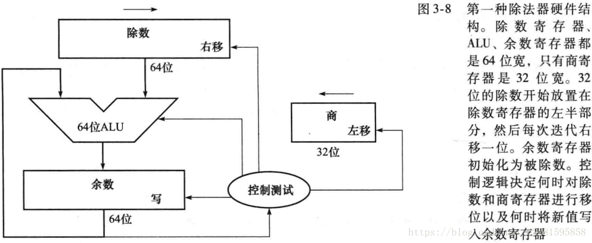

##说明

处理器应支持如下指令集：
cal_R:add,sub,and,or,slt,sltu

cal_I:ori,addi, andi

load:lw,lb,lh

store:sw,sb,sh

md:mult,multu,div,divu

mf:mfhi,mflo

mt:mthi,mtlo

B类:beq,bne

J类:jal

特殊:jr

lui

##功能模块

###外置IM DM

|      | 信号名        | 方向 | 位宽 | 描述                                       |
| ---- | :------------ | :--- | :--- | :----------------------------------------- |
|      | clk           | I    | 1    | 时钟信号                                   |
|      | reset         | I    | 1    | 同步复位信号                               |
| IM   | i_inst_addr   | O    | 32   | 需要进行取指操作的流水级 PC（一般为 F 级） |
|      | i_inst_rdata  | I    | 32   | i_inst_addr对应的32位指令                  |
| DM   | m_data_addr   | O    | 32   | 待写入/读出的数据存储器相应地址            |
|      | m_data_wdata  | O    | 32   | 待写入数据存储器相应数据                   |
|      | m_data_byteen | O    | 4    | 四位字节使能                               |
|      | m_inst_addr   | O    | 32   | M级PC                                      |
|      | m_data_rdata  | I    | 32   | m_data_addr 对应的32位数据                 |
| GRF  | w_grf_we      | O    | 1    | GRF写使能信号                              |
|      | w_grf_addr    | O    | 5    | GRF 中待写入寄存器编号                     |
|      | w_grf_wdata   | O    | 32   | GRF 中待写入数据                           |
|      | w_inst_addr   | O    | 32   | W 级 PC                                    |

###F级：

IFU(取指令单元)

| 信号名 | 方向 | 位宽 | 描述           |
| ------ | ---- | ---- | -------------- |
| clk    | I    | 1    | 时钟信号       |
| reset  | I    | 1    | 同步复位信号   |
| en     | I    | 1    | 使能信号       |
| npc    | I    | 32   | 下一条指令地址 |
| pc     | O    | 32   | F_pc           |

###D级：

EXT

| 信号名 | 方向 | 位宽 | 描述                                |
| ------ | ---- | ---- | ----------------------------------- |
| EXT_op | I    | 1    | lui拓展(10)/符号扩展(01)/零扩展(00) |
| in     | I    | 16   | 16位立即数                          |
| out    | O    | 32   | 扩展后32位结果                      |

NPC(下一指令计算单元)

| 信号名           | 方向 | 位宽 | 描述                                                         |
| ---------------- | ---- | ---- | ------------------------------------------------------------ |
| F_pc             | I    | 32   | F_pc                                                         |
| D_pc             | I    | 32   | D_pc                                                         |
| NPC_op           | I    | 3    | 指令类型选择:<br />000:顺序执行<br />001:B类/beq<br />010:jal<br />011:jr |
| instr_offset_ext | I    | 32   | D级16位立即数零扩展/符号扩展的32位                           |
| instr_index      | I    | 26   | D级指令数据的0:25，用于计算jal所要跳转的地址                 |
| pc_rs            | I    | 32   | D级指令数据的21:25所表示rs寄存器中存储的地址                 |
| judge_b          | I    | 1    | D级b类跳转指令是否满足 1:跳 0:不跳  (D_CMP_out)              |
| npc              | O    | 32   | 下一条要被执行的指令的地址                                   |

GRF(通用寄存器组)

| 信号名 | 方向 | 位宽 | 描述                                                         |
| ------ | ---- | ---- | ------------------------------------------------------------ |
| clk    | I    | 1    | 时钟信号                                                     |
| reset  | I    | 1    | 同步复位信号 1：复位信号有效 0：复位信号无效                 |
| pc     | I    | 32   | W_pc                                                         |
| WE     | I    | 1    | W写使能信号 1：写入有效 0：写入失效                          |
| WA     | I    | 5    | W地址输入信号，指定32个寄存器中的一个，将其作为写入目标      |
| WD     | I    | 32   | W写入的数据                                                  |
| RA1    | I    | 5    | D地址输入信号，指定32个寄存器中的一个，将其中的数据读出到RD1 |
| RA2    | I    | 5    | D地址输入信号，指定32个寄存器中的一个，将其中的数据读出到RD2 |
| RD1    | O    | 32   | D输出A1指定的寄存器中的32位数据                              |
| RD2    | O    | 32   | D输出A2指定的寄存器中的32位数据                              |

CMP(B类指令比较单元)

| 信号名 | 方向 | 位宽 | 描述                                                         |
| :----- | :--- | :--- | :----------------------------------------------------------- |
| RD1    | I    | 32   | 输入CMP单元的第一个数据                                      |
| RD2    | I    | 32   | 输入CMP单元的第二个数据                                      |
| CMP_op | I    | 3    | CMP_op功能选择信号<br />000:beq判断 <br />001:bne判断(可扩展) |
| out    | O    | 1    | 判断结果输出 1: 判断结果为真  0：判断结果为假                |

### E级：

ALU(逻辑运算单元)

| 信号名     | 方向 | 位宽 | 描述                       |
| ---------- | ---- | ---- | -------------------------- |
| A          | I    | 32   | 第一个运算数               |
| B          | I    | 32   | 第二个运算数               |
| ALU_op     | I    | 4    | 选择运算方式(**扩展要点**) |
| ALU_result | O    | 32   | 运算结果                   |

MDU(乘除法模块)

注：内部的HI、LO寄存器

| 信号名 | 方向 | 位宽 | 描述                                                         |
| :----- | :--- | :--- | :----------------------------------------------------------- |
| clk    | I    | 1    | 时钟信号                                                     |
| reset  | I    | 1    | 复位信号                                                     |
| Start  | I    | 1    | 乘除运算启动信号                                             |
| MDU_op | I    | 4    | 乘除模块功能选择 <br />0x0000：空指令<br /> 0x0001：mult指令<br /> 0x0010：multu指令<br />0x0011：div指令<br /> 0x0100：divu指令<br /> 0x0101：mfhi指令<br /> 0x0110：mflo指令<br /> 0x0111：mthi指令<br />0x1000：mtlo指令 |
| A      | I    | 32   | 运算数据RD1                                                  |
| B      | I    | 32   | 运算数据RD2                                                  |
| HI     | O    | 32   | HI寄存器输出值                                               |
| LO     | O    | 32   | LO寄存器输出值                                               |
| out    | O    | 32   | MDU输出值（HI、LO中选择）                                    |
| Busy   | O    | 1    | 乘除运算进行信号                                             |

### M级：

BE(字节使能模块)

| 信号名 | 方向 | 位宽 | 描述                                        |
| ------ | ---- | ---- | ------------------------------------------- |
| A      | I    | 2    | DM写入地址的低2位                           |
| BE_op  | I    | 2    | 00:非store<br />01:sw<br />10:sh<br />11:sb |
| Din    | I    | 32   | 未处理的寄存器数据                          |
| byteen | O    | 4    | 字节使能信号                                |
| Dout   | O    | 32   | 处理后的寄存器数据                          |

|           | BE_op[1:0] | A[1:0] | byteen[3:0] |
| --------- | ---------- | ------ | ----------- |
| BE_nstore | 00         | xx     | 0000        |
| BE_sw     | 01         | xx     | 1111        |
| BE_sh     | 10         | 0x     | 0011        |
| BE_sh     | 10         | 1x     | 1100        |
| BE_sb     | 11         | 00     | 0001        |
| BE_sb     | 11         | 01     | 0010        |
| BE_sb     | 11         | 10     | 0100        |
| BE_sb     | 11         | 11     | 1000        |

DE(数据扩展模块)

| 信号名 | 方向 | 位宽 | 描述                                                         |
| :----- | :--- | :--- | :----------------------------------------------------------- |
| A      | I    | 2    | DM写入地址的低2位                                            |
| RDin   | I    | 32   | 未经处理的DM读出数据                                         |
| DE_op  | I    | 3    | 访存功能信号<br />000：无扩展<br/>001：无符号字节数据扩展<br/>010：符号字节数据扩展<br/>011：无符号半字数据扩展<br/>100：符号半字数据扩展 |
| RDout  | O    | 32   | 处理后的DM读出数据                                           |

## 流水寄存器

Tnew也在流水寄存器中

###DREG(IF/ID流水寄存器)

| 方向 | 信号名  | 位宽 | 描述              | 输入来源      |
| :--- | :------ | :--- | :---------------- | :------------ |
| I    | clk     | 1    | 时钟信号          | mips.v中的clk |
| I    | reset   | 1    | 同步复位          |               |
| I    | en      | 1    | D级寄存器使能信号 |               |
| I    | F_instr | 32   | F级instr输入      | F_instr       |
| I    | F_pc    | 32   | F级pc输入         | F_pc          |
| O    | D_instr | 32   | D级instr输出      |               |
| O    | D_pc    | 32   | D级pc输出         |               |

###EREG(ID/EXE寄存器)

| 方向 | 信号名    | 位宽 | 描述              | 输入来源                |
| :--- | :-------- | :--- | :---------------- | :---------------------- |
| I    | clk       | 1    | 时钟信号          | mips.v中的clk           |
| I    | reset     | 1    | 同步复位          |                         |
| I    | clr       | 1    | E级寄存器清空信号 | HCU中stall信号          |
| I    | D_instr   | 32   | D级instr输入      |                         |
| I    | D_pc      | 32   | D级pc输入         |                         |
| I    | D_GRF_RD1 | 32   | D级GRF_RD1输入    | 转发                    |
| I    | D_GRF_RD2 | 32   | D级GRF_RD2输入    | 转发                    |
| I    | D_GRF_WA  | 5    | D级GRF_WA输入     | MUX                     |
| I    | D_EXT_out | 32   | D级EXT_out输入    | 通过EXT模块扩展出的数据 |
| I    | Tnew_D    | 2    | D级指令的Tnew     | DMCU产生                |
| O    | E_instr   | 32   | E级instr输出      |                         |
| O    | E_pc      | 32   | E级pc输出         |                         |
| O    | E_GRF_RD1 | 32   | E级GRF_RD1输出    |                         |
| O    | E_GRF_RD2 | 32   | E级GRF_RD2输出    |                         |
| O    | E_GRF_WA  | 5    | E级GRF_WA输出     |                         |
| O    | E_EXT_out | 32   | E级EXT_out输出    |                         |
| O    | Tnew_E    | 2    | max{Tnew_D - 1,0} |                         |

### MREG(EX/MEM流水寄存器)

| 方向 | 信号名       | 位宽 | 描述              | 输入来源      |
| :--- | :----------- | :--- | :---------------- | :------------ |
| I    | clk          | 1    | 时钟信号          | mips.v中的clk |
| I    | reset        | 1    | 同步复位          |               |
| I    | E_instr      | 32   | E级instr输入      |               |
| I    | E_pc         | 32   | E级pc输入         |               |
| I    | E_GRF_RD2    | 32   | E级GRF_RD2输入    | ////          |
| I    | E_GRF_WA     | 5    | E级GRF_WA输入     | MUX           |
| I    | E_ALU_result | 32   | E级ALU_result输入 |               |
| I    | E_MDU_result | 32   | E级MDU_result输入 |               |
| I    | Tnew_E       | 2    | E级指令的Tnew     |               |
| O    | M_instr      | 32   | M级instr输出      |               |
| O    | M_pc         | 32   | M级pc输出         |               |
| O    | M_GRF_RD2    | 32   | M级GRF_RD2输出    | ////          |
| O    | M_GRF_WA     | 5    | M级GRF_WA输出     |               |
| O    | M_ALU_result | 32   | M级ALU_result输出 |               |
| O    | M_MDU_result | 32   | M级MDU_result输出 |               |
| O    | Tnew_M       | 2    | max{Tnew_E - 1,0} |               |

### WREG(MEM/WB流水寄存器)

| 方向 | 信号名       | 位宽 | 描述              | 输入来源      |
| :--- | :----------- | :--- | :---------------- | :------------ |
| I    | clk          | 1    | 时钟信号          | mips.v中的clk |
| I    | reset        | 1    | 同步复位          |               |
| I    | M_instr      | 32   | M级instr输出      |               |
| I    | M_pc         | 32   | M级pc输入         |               |
| I    | M_DM_RD      | 32   | M级DM_RD输入      |               |
| I    | M_GRF_WA     | 5    | M级GRF_WA输入     |               |
| I    | M_ALU_result | 32   | M级ALU_result输入 |               |
| I    | M_MDU_result | 32   | M级MDU_result输入 |               |
| I    | Tnew_M       | 2    | M级指令的Tnew     |               |
| O    | W_instr      | 32   | W级instr输出      |               |
| O    | W_pc         | 32   | W级pc输出         |               |
| O    | W_DM_RD      | 32   | W级DM_RD输出      |               |
| O    | W_GRF_WA     | 5    | W级GRF_WA输出     |               |
| O    | W_ALU_result | 32   | W级ALU_result输出 |               |
| O    | W_MDU_result | 32   | W级MDU_result输出 |               |
| O    | Tnew_W       | 2    | max{Tnew_W - 1,0} |               |

## 控制模块

### MCU（主控制器模块）

* 输入

| 信号名 | 位宽 | 描述      |
| :----- | :--- | :-------- |
| pc     | 32   | 当前pc    |
| instr  | 32   | 当前instr |

* 输出

| 信号名      | 位宽 | 描述                                                         |
| ----------- | ---- | ------------------------------------------------------------ |
| Op          | 6    | instr[31:26]                                                 |
| Func        | 6    | instr[5:0]                                                   |
| rs          | 5    | instr[25:21]                                                 |
| rt          | 5    | instr[20:16]                                                 |
| rd          | 5    | instr[15:11]                                                 |
| instr_index | 26   | instr[25:0]                                                  |
| Imm         | 16   | instr[15:0]                                                  |
| RegWrite    | 1    | Reg写数据使能                                                |
| GRF_WA      | 5    | R_type:D_instr_rd<br />lw/lui/ori:D_instr_rt<br />jal:0x1f   |
| Sel_GRF_WD  | 2    | 寄存器堆写入端数据源选择                                     |
| Sel_ALU_B   | 1    | ALU输入端B数据源选择                                         |
| Sel_E_out   | 1    | E级储存的计算结果选择                                        |
| Sel_M_out   | 2    | M级储存的计算结果选择                                        |
| Sel_W_out   | 2    | W级储存的计算结果选择                                        |
| MemRead     | 1    | DM读数据使能                                                 |
| MemWrite    | 1    | DM写数据使能                                                 |
| ALU_op      | 3    | ALU模块功能选择信号                                          |
| MDU_op      | 4    | MDU模块功能选择信号                                          |
| Start       | 1    | 1:md&&(~busy)                                                |
| NPC_op      | 3    | 指令类型选择： <br />000:顺序执行<br />001:B类<br />010:jal<br />011:jr |
| CMP_op      | 3    | CMP模块功能选择信号<br />0x000：beq判断 (可扩展)             |
| EXT_op      | 2    | EXT模块功能选择信号<br />lui(10)/符号扩展(01)/零扩展(00)     |
| BE_op       | 2    | 00:非store<br />01:sw <br />10:sh<br />11:sb                 |
| DE_op       | 3    | 数据扩展控制码<br/>000：无扩展<br/>001：无符号字节数据扩展<br/>010：符号字节数据扩展<br/>011：无符号半字数据扩展<br/>100：符号半字数据扩展 |
| Tuse_rs     | 2    | 具体值见转发与暂停                                           |
| Tuse_rt     | 2    | 同上                                                         |
| Tnew_D      | 2    | 同上                                                         |

### HCU（冒险控制器模块）

- **前位点的读取寄存器地址和某转发输入来源的写入寄存器地址相等且不为 0**
- **写使能信号有效**

根据以上条件我们可以生成上面的5个HMUX选择信号，选择信号的输出值应遵循“就近原则”，及最先产生的数据最先被转发。

- 输入

| 信号名      | 位宽 | 描述                      |
| :---------- | :--- | :------------------------ |
| D_GRF_RA1   | 5    | D级GRF_RA1输入            |
| D_GRF_RA2   | 5    | D级GRF_RA2输入            |
| E_GRF_RA1   | 5    | E级GRF_RA1输入            |
| E_GRF_RA2   | 5    | E级GRF_RA2输入            |
| E_GRF_WA    | 5    | E级GRF_WA输入             |
| E_WE        | 1    | E级写使能信号             |
| M_GRF_RA2   | 5    | M级GRF_RA2输入            |
| M_GRF_WA    | 5    | M级GRF_WA输入             |
| M_WE        | 1    | M级写使能信号             |
| W_GRF_WA    | 5    | W级GRF_WA输入             |
| W_WE        | 1    | W级写使能信号             |
| Tuse_rs     | 2    | D级MCU中输出的Tuse_rs信号 |
| Tuse_rt     | 2    | D级MCU中输出的Tuse_rt信号 |
| Tnew_E      | 2    | E级Tnew_E信号输入         |
| Tnew_M      | 2    | M级Tnew_E信号输入         |
| Tnew_W      | 2    | W级Tnew_E信号输入         |
| E_MDU_Start | 1    | E级MDU模块Start           |
| E_MDU_Busy  | 1    | E级MDU模块Busy            |

- 输出

| 信号名       | 位宽 | 作用级  | 描述                        |
| :----------- | :--- | :------ | :-------------------------- |
| FW_CMP_RD1_D | 2    | D       | 对HMUX_CMP_D1的输出进行选择 |
| FW_CMP_RD2_D | 2    | D       | 对HMUX_CMP_D2的输出进行选择 |
| FW_ALU_A_E   | 2    | E       | 对HMUX_ALU_A的输出进行选择  |
| FW_ALU_B_E   | 2    | E       | 对HMUX_ALU_B的输出进行选择  |
| FW_DM_RD_M   | 1    | M       | 对HMUX_DM_RD的输出进行选择  |
| stall        | 1    | F、D、M | 暂停信号                    |

## 选择器模块

### 功能MUX

####内部选择数据输入

| 级别 | MUX名      | 描述                                                         | 控制信号   | 输出信号 |
| ---- | ---------- | ------------------------------------------------------------ | ---------- | -------- |
| E级  | MUX_ALU_B  | 0:E_GRF_RD2<br />1:E_ext                                     | Sel_ALU_B  | ALU_B    |
| W级  | MUX_GRF_WD | 00:W_ALU_result<br />01:W_MDU_result<br />10:W_DM_RD<br />11:pc_8 | Sel_GRF_WD | GRF_WD   |

#### 流水级寄存器输出选择(数据通路中实现)

| 描述                                                         | 控制信号  | 输出信号 |
| ------------------------------------------------------------ | --------- | -------- |
| 选择E级存储的计算结果<br />0:E_EXT_out<br />1:E_pc_8         | Sel_E_out | E_out    |
| 选择M级存储的计算结果<br />0:M_ALU_result<br />1:M_MDU_result<br />2:M_pc_8 | Sel_M_out | M_out    |
| 选择W级存储的计算结果<br />0:W_ALU_result<br />1:W_MDU_result<br />2:W_DM_RD<br />3:W_pc_8 | Sel_W_out | W_out    |

### 转发MUX

| 接收端口          | MUX名          | 描述                        | 控制信号     | 输出信号    |
| ----------------- | -------------- | --------------------------- | ------------ | ----------- |
| CMP_RD1 NPC_pc_rs | HMUX_CMP_RD1_D | 0:D_GRF_RD1 1:M_out 2:E_out | FW_CMP_RD1_D | D_GRF_RD1_f |
| CMP_RD2           | HMUX_CMP_RD2_D | 0:D_GRF_RD2 1:M_out 2:E_out | FW_CMP_RD2_D | D_GRF_RD2_f |
| ALU_A             | HMUX_ALU_A_E   | 0:E_GRF_RD1 1:W_out 2:M_out | FW_ALU_A_E   | E_GRF_RD1_f |
| ALU_B             | HMUX_ALU_B_E   | 0:E_GRF_RD2 1:W_out 2:M_out | FW_ALU_B_E   | E_GRF_RD2_f |
| DM_WD             | HMUX_DM_WD_M   | 0:M_GRF_RD2 1:W_out         | FW_DM_WD_M   | M_GRF_RD2_f |

##转发与暂停

- Tuse：指令进入 **D 级**后，其后的某个功能部件**再**经过多少时钟周期就**必须**要使用寄存器值。对于有两个操作数的指令，其**每个操作数的 Tuse 值可能不等**（如 store 型指令 rs、rt 的 Tuse 分别为 1 和 2 ）。

- Tnew：位于 **E 级及其后各级**的指令，再经过多少周期就能够产生要写入寄存器的结果。在我们目前的 CPU 中，W 级的指令Tnew 恒为 0；对于同一条指令，Tnew@M = max(Tnew@E - 1, 0)

- **Tuse表**(X取最大值)

  | 指令类型 | Tuse_rs | Tuse_rt |
  | :------- | :------ | :------ |
  | calc_R   | 1       | 1       |
  | calc_I   | 1       | X       |
  | load     | 1       | X       |
  | store    | 1       | 2       |
  | md       | 1       | 1       |
  | mt       | 1       | X       |
  | mf       | X       | X       |
  | B_type   | 0       | 0       |
  | jump     | X       | X       |
  | jr       | 0       | X       |

- **Tnew表**(X取最小值)

  | 产生结果的功能部件 | 指令类型 | Tnew_D | Tnew_E | Tnew_M | Tnew_W |
  | ------------------ | :------- | :----- | :----- | :----- | :----- |
  | ALU                | calc_R   | 2      | 1      | 0      | 0      |
  | ALU                | calc_I   | 2      | 1      | 0      | 0      |
  | DM                 | load     | 3      | 2      | 1      | 0      |
  |                    | store    | X      | X      | X      | X      |
  |                    | md       | X      | X      | X      | X      |
  |                    | mt       | X      | X      | X      | X      |
  | MDU                | mf       | 2      | 1      | 0      | 0      |
  |                    | branch   | X      | X      | X      | X      |
  | PC                 | jal      | 0      | 0      | 0      | 0      |
  |                    | jr       | X      | X      | X      | X      |
  | EXT                | lui      | 1      | 0      | 0      | 0      |

然后我们Tnew和Tuse传入HCU（冒险控制器中），然后进行stall信号的计算。如果Tnew > TuseHCU中的stall信号值为1，此时执行以下操作——

- **冻结PC寄存器（IFU_en = ~stall = 0）**

- **冻结D级寄存器（D_en = ~stall = 0）**

- **清空E级寄存器（E_clr = stall = 1）**

  ---

**在课上测试时，我们需要你现场实现新的指令，对于这些新的指令，你可能需要在原有的数据通路上做哪些扩展或修改？提示：你可以对指令进行分类，思考每一类指令可能修改或扩展哪些位置。**

​	MCU控制信号的生成

​	可能还需要HCU中AT的更改、流水级寄存器

- 寄存器立即数计算：`addi, addiu, slti, sltiu, andi, ori, xori, sll, srl, sra`

  EXT ALU

- 寄存器寄存器计算：`add, addu, sub, subu, slt, sltu, and, or, nor, xor, sllv, srlv, srav`

  ALU

- 根据寄存器分支：`beq, bne, bgez, bgtz, blez, bltz`

  CMP NPC EXT

- 写内存：`sw, sh, sb`

  DM

- 读内存：`lw, lh, lhu, lb, lbu`

  DM

- 跳转并链接：`jal, jalr`

  NPC

- 跳转寄存器：`jr, jalr`

  NPC

- 加载高位：`lui`

- 空指令：`nop`

**我们转发时数据的需求者和供给者可能来源于哪些位置？共有哪些转发数据通路？**

需求者：CMP_RD1/NPC_pc_rs,CMP_RD2	EGRF	ALU_A,ALU_B	MGRF	DM_WD

供给者：E级流水寄存器：EXT_out,pc_8

​				M级流水寄存器：ALU_result,MDU_result,pc_8

​				W级流水寄存器：ALU_result,MDU_result,DM_RD,pc_8

E→D M→D

M→E W→E

W→M

​		需求者方有一个MUX，根据要用的RA与供给者方的RA、Tnew、WE选择

​		供给者方有一个MUX，根据本级指令选择提供的数据

---

> **不跳转时清空延迟槽**:需要根据当前**CMP模块输出结果**判断是否清空**D级流水寄存器**

```verilog
wire D_Reg_clr = check_D & ~D_CMP_out & ~stall;
```

> **MDU符号加**

```verilog
wire D_Reg_clr = check_D & ~D_CMP_out & ~stall;
```

> **条件存储**

```verilog
//笔者采用的命名方法是——A1和A2表示该流水级指令的GRF读地址,A3表示指令的GRF写地址
//例如，如果E级指令为addu，则E_A1为rs域数据，E_A2为rt域数据，E_A3为rd域数据
//RFWrite表示GRF写入使能信号
//check信号有效则表示该流水级指令为新指令
////////////////////////////////////////////////////
//第一种题型(eg：condition满足向rt号写，否则写31号)
    assign   stall_rs_E = (D_A1 != 5'd0) & (check_E ? (D_A1 == E_A3 | D_A1 == 5'd31) : D_A1 == E_A3) & (RFWrite_E) & (Tuse_rs < Tnew_E);
    assign   stall_rs_M = (D_A1 != 5'd0) & (check_M ? (D_A1 == M_A3 | D_A1 == 5'd31) : D_A1 == M_A3) & (RFWrite_M) & (Tuse_rs < Tnew_M);
    assign   stall_rt_E = (D_A2 != 5'd0) & (check_E ? (D_A2 == E_A3 | D_A2 == 5'd31) : D_A2 == E_A3) & (RFWrite_E) & (Tuse_rt < Tnew_E);
    assign   stall_rt_M = (D_A2 != 5'd0) & (check_M ? (D_A2 == M_A3 | D_A2 == 5'd31) : D_A2 == M_A3) & (RFWrite_M) & (Tuse_rt < Tnew_M);
//第二种题型 (eg：condition满足向31号写，否则不写) 
//按照第一种题型以写成  (check_M ? (D_A2 == 5'd31 | D_A2 == 5'd0): D_A2 == M_A3),因为前面有条件 D_A2 != 5'd0，所以可以简化
    assign   stall_rt_M = (D_A2 != 5'd0) & (check_M ? D_A2 == 5'd31 : D_A2 == M_A3) & (RFWrite_M) & (Tuse_rt < Tnew_M);
//第三种题型 (eg：condition满足时写入位置为DM的读取值的低五位)   
    assign   stall_rt_M = (D_A2 != 5'd0) & (check_M ? 1'b1 : D_A2 == M_A3) & (RFWrite_M) & (Tuse_rt < Tnew_M);
```

此外我们还需要在M级根据DM取出的值修改`A3`(GRF写入地址),代码如下——

```verilog
//第一种题型(eg：condition满足向rt号写，否则写31号)
    wire M_A3_new = check_M ? (condition ? `rt : 5'd31) : M_A3; 
//第二种题型 (eg：condition满足向31号写，否则不写) 
    wire M_A3_new = check_M ? (condition ? 5'd31 : 5'd0) : M_A3; 
//第三种题型 (eg：写入位置为DM的读取值的低五位)  
    wire M_A3_new = check_M ? DM_out[4:0] : M_A3; 
```

这样一来，我们在M级就将可以将正确的GRF写入地址修改，然后再传入下一级流水寄存器(W_Reg)和冒险控制器(HCU)即可。

#思考题

1. <u>为什么需要有单独的乘除法部件而不是整合进 ALU？为何需要有独立的 HI、LO 寄存器？</u>

   单独的乘除法部件可以保证在运算延迟的过程中，非md、mf、mt的指令可以正常访问ALU并执行，提高速度。

   HI和LO是只与乘法运算器相关的寄存器，可以保证乘除法运算的结果不会被其他指令的运算结果所覆盖，同时也方便程序员在需要时获取乘除法运算的结果。

2. <u>真实的流水线 CPU 是如何使用实现乘除法的？请查阅相关资料进行简单说明。</u>

   乘法操作：流水线 CPU通常会将乘法操作分解为乘法器的部分和累加器的部分。在第一个阶段，流水线 CPU会将乘法操作的两个操作数送入乘法器进行部分乘法计算。然后，在后续的流水线阶段，乘法器的结果会经过累加器进行部分累加，直到最终得到完整的乘法结果。2^5=32

   除法操作：

3. <u>请结合自己的实现分析，你是如何处理 Busy 信号带来的周期阻塞的？</u>

   ```verilog
   stall = stall_rs || stall_rt || ((E_MDU_Start || E_MDU_Busy)&&(D_md || D_mf || D_mt));
   ```

   E级Busy信号处于高电平且D级指令为md、mf、mt时进行阻塞

4. <u>请问采用字节使能信号的方式处理写指令有什么好处？（提示：从清晰性、统一性等角度考虑）</u>

   清晰性：字节使能信号可以清晰地指示哪些字节需要被写入，不需要额外的解释或计算

   统一性：字节使能信号可以统一处理字节、半字、字这些不同长度的写指令

   灵活性：字节使能信号可以灵活地控制每个字节的写入操作，可以根据需要选择性地写入部分数据，而不是强制性地写入整个数据

5. <u>请思考，我们在按字节读和按字节写时，实际从 DM 获得的数据和向 DM 写入的数据是否是一字节？在什么情况下我们按字节读和按字节写的效率会高于按字读和按字写呢？</u>

   实际接线时从 DM 获得的数据和向 DM 写入的数据可以实现一字节读/写；我们tb里面DM按字存储，在写入时仍然是按字读取-更改-写入。

   按字读和按字节读效率没有很大区别；

   按字写和按字节写在需要单独控制每个字节的写入时后者效率更高。

6. <u>为了对抗复杂性你采取了哪些抽象和规范手段？这些手段在译码和处理数据冲突的时候有什么样的特点与帮助？</u>

   - 根据指令需求对指令进行分类
   - 重复度过高的赋值部分使用宏定义

   在译码时便于按类对相关控制信号统一赋值，局部细节不同之处微调

7. <u>在本实验中你遇到了哪些不同指令类型组合产生的冲突？你又是如何解决的？相应的测试样例是什么样的？</u>

   数据冲突:E级新增MDU模块

   - md后为mf、mt--阻塞
   - mf、mt后有数据冲突--M级转发、W级内部转发

   结构冲突:新增bne指令，处理同beq

   ```mips
   lui $1 0x0014
   lui $2 0xffff
   ori $1 $1 0x5678
   ori $2 $2 0xabcd
   mult $1 $2
   mfhi $s0
   mflo $s1
   
   div $1 $2
   mfhi $s0
   mflo $s1
   bne $s0 $0 label
   nop
   ori $1 1
   label:
   beq $0 $0 label
   nop
   ```

   

8. <u>如果你是手动构造的样例，请说明构造策略，说明你的测试程序如何保证**覆盖**了所有需要测试的情况；如果你是**完全随机**生成的测试样例，请思考完全随机的测试程序有何不足之处；如果你在生成测试样例时采用了**特殊的策略**，比如构造连续数据冒险序列，请你描述一下你使用的策略如何**结合了随机性**达到强测的效果。</u>

   功能测试

   暂停转发测试:针对每一级转发/暂停 每一种供给者构造样例

   > 需求者：CMP_RD1/NPC_pc_rs,CMP_RD2	EGRF	ALU_A,ALU_B	MGRF	DM_WD
   >
   > 供给者：E级流水寄存器：EXT_out,pc_8
   >
   > ​				M级流水寄存器：ALU_result,MDU_result,pc_8
   >
   > ​				W级流水寄存器：ALU_result,MDU_result,DM_RD,pc_8
   >
   > E→D M→D
   >
   > M→E W→E
   >
   > W→M

   ```mips
   #E->D
   ###EXT_out
   ori $1, 0xff00
   lui $2, 0x00aa
   add $3 $1 $2
   ###pc_8
   jal labal
   sub $3 $3 $31
   label:
   or $3 $1 $2
   
   #M->D
   ###ALU_result
   addi $1 $0 0xff00
   nop
   beq $1 $2 label_b
   andi $3 $1 0x0a00
   label_b:
   #...
   
   #M->E
   ###ALU_result
   add $3 $1 $2
   sub $3 $3 $2
   ###MDU_result
   ori $1, 0
   ori $2, 0
   lui $1 0x0014
   lui $2 0xffff
   ori $1 $1 0x5678
   ori $2 $2 0xabcd
   mult $1 $2
   mfhi $s0
   add $3 $s0 $0
   #...
   
   #W→M
   ori $1 $0 4
   sw $3 0($1)
   ```

   
